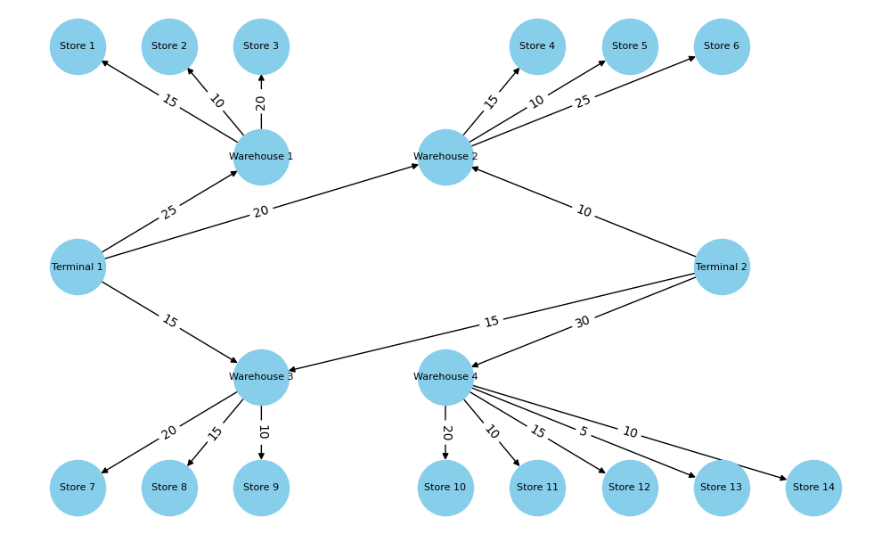
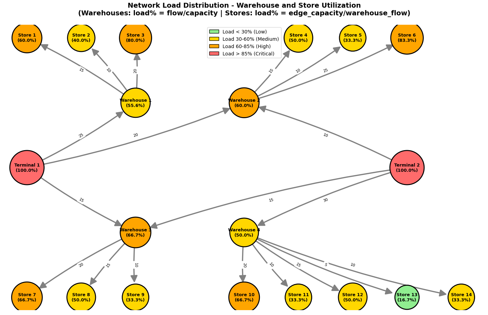

# GoIT Algorithms 2.0 Homework

This repository contains solutions for two algorithm tasks:

- applying the maximum flow algorithm to model logistics networks, analyzing optimal routes of commodity flows and identifying network constraints.

- expanding the functionality of the Trie tree, see how this data structure helps solve real-world text search and analysis problems.

## Task 1. Application of the maximum flow algorithm for goods logistics

A program for modeling a flow network for the logistics of goods from warehouses to stores, using the maximum flow algorithm. The results obtained were analyzed and compared with theoretical knowledge.

**Initial data:**

```bash
cat task_1/logistics_network_simulator/data.py
```

### Network for the logistics of goods from warehouses



### Network Load Distribution - Warehouse and Store Utilization



[Task 1. Result](./task_1/README.md)

## Task 2. Extending the prefix tree functionality

Implementation of two additional methods for the Trie class:

- count_words_with_suffix(pattern) - to count the number of words ending with a given pattern;

- has_prefix(prefix) - to check for the presence of words with a given prefix.

```bash
# Run task 2
python task_2/extend_trie.py
```
